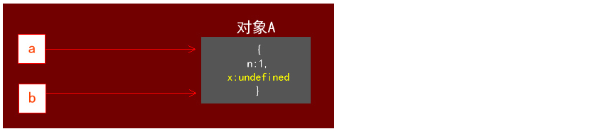
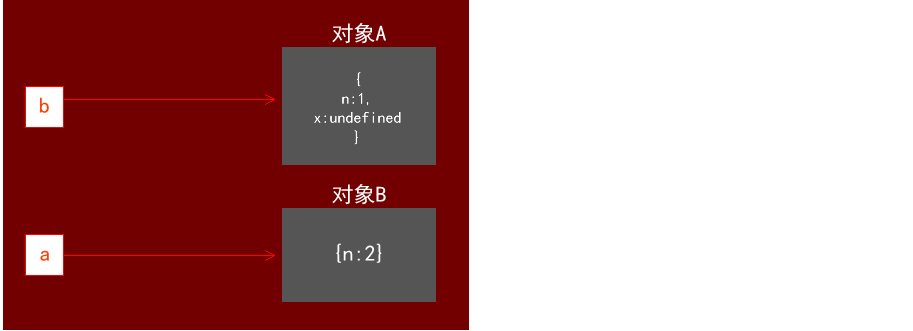
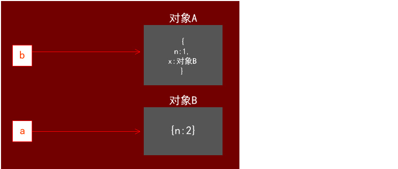

## JavaScript 连续赋值的坑

来自于
https://www.w3cschool.cn/vnpqd/vnpqd-ux8c25rv.html

#### 导语：
 > 这个问题是在W3C上学习的时候看到的，在这里要注意的重点是：
 
 >1.运算符的优先级问题。
 
 >2.引用数据类型的赋值问题。
 
 
 * 问题代码
 
 下面这段代码在引擎内部到底发生了什么？
 
```$xslt
var a={n:1};
a.x=a={m:2};
alert(a.x) --->undefined
```

1.正常理解顺序：（按照从右到左复制顺序）

 * a赋值为{n:2}，a.x 发现a被重写，a.x={n:2}
  
-----
#解：

* 上面的猜想是错误的，忽略了**引用关系**和**运算符的优先级**问题

* 改写一下**代码**

```$xslt
var a={n:1};
var b=a; --->变量b指向a的引用地址
a.x=a={n:2};
console.log(a.x);
console.log(b.x);
```

` var a={n:1}; var b=a;`
* 在这里a指向了一个对象{n:1}（我们称为对象A），b指向了a所指向的对象，现在a和b的引用地址是一致的

` a.x=a={n:2}`
* 接着来看这段代码， **非常重要**
```
   可以肯定的是js的赋值预算顺序永远都是从右往左的，
   但是由于"."是优先最高的运算符,所以这行代码优先计算了a.x
   那么现在的a.x所指向的是{n:1}，相当于给a增加了新的属性x（虽然这个x是的值是undefined）
   因为b同样也指向了a，所以现在也可以用b.x
```


```$xslt
   继续（从右向左）执行代码a={n:2},这时候a的指向发生了变化，变成了新的对象{n:2}（我们称为对象B）
```


```$xslt
   继续（向右）执行代码 a.x=a,这时会认为是给对象B也新增了一个属性x
 
   但是实际并非如此 
   (由于.  运算符最先计算,一开始js已经先计算了a.x，便已经解析了这个a.x是对象A的x，
   所以在同一条公式的情况下再回来给a.x赋值，也不会说重新解析这个a.x为对象B的x。)，
   a.x=a是将的a的值赋值给a.x,现在的a.x的引用地址是A，所以相当于a.x={n:2},
   可以理解为A的属性x指向了对象B
```


```$xslt
那么这时候结果就显而易见了。当console.log(a.x)的时候，a是指向对象B的，但对象B没有属性x。
没关系，当查找一个对象的属性时，JavaScript 会向上遍历原型链，直到找到给定名称的属性为止。
但当查找到达原型链的顶部 - 也就是 Object.prototype - 仍然没有找到指定的属性B.prototype.x，
自然也就输出undefined；

而在console.log(b.x)的时候，由于b.x表示对象A的x属性，该属性是指向对象B，
自然也输出了[object Object]了，注意这里的[object Object]可不是2个对象的意思，
对象的字符串形式，是隐式调用了Object对象的toString()方法，形式是："[object Object]"。
所以[object Object]表示的就只是一个对象罢了
```

###代码执行顺序：不要怀疑下面的代码没有错

```$xslt
1. var a={n:1} ---> 引用地址1xxxxx  对象A ->{n:1}
2. var b=a     ---> 引用地址1xxxxx  对象A
 
 a.x=a={n:2}  (*从右到左*)
3. a.x  （点优先执行）      --->引用地址1xxxxx 对象A ->{n:1,x:'undefined'}
4. a={n:2}                --->引用地址2xxxxx 对象B ->{n:2}
5. a.x=a  (已经解析过地址仍然是A) --->引用地址1xxxxx 对象A ->A.x=a ->A.x=a=B ->A.x={n:1}
console.log(a.x)--->undefined
 
```


 
 
 
 
 