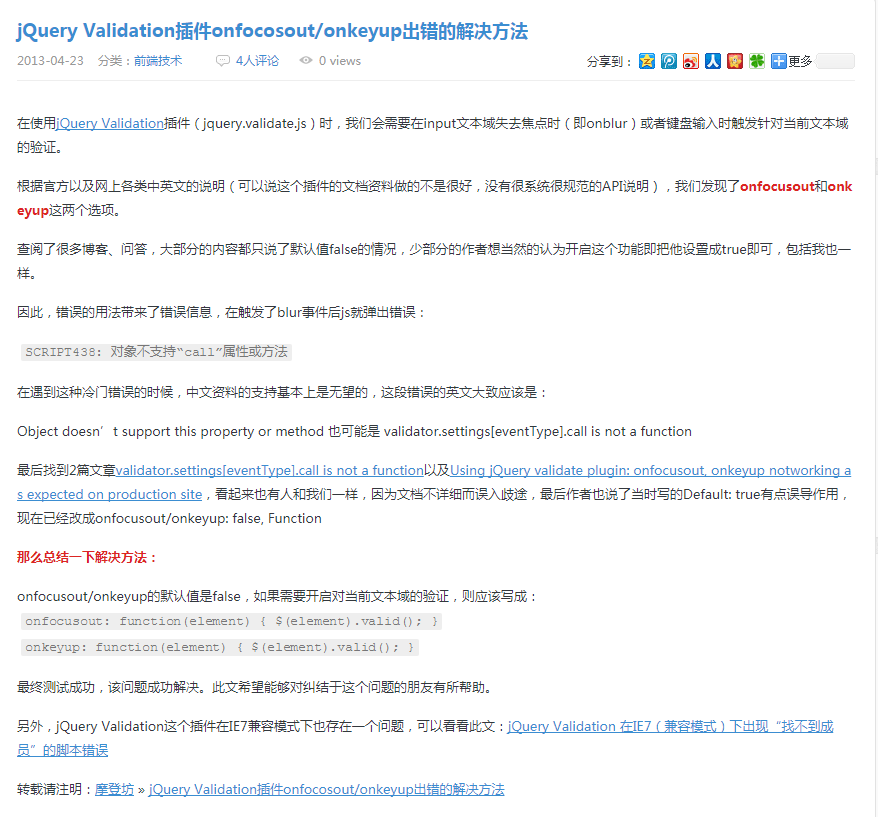

## 表单验证插件使用问题以及经验总结

>  在设置鼠标blur验证的时候报错
```js
//错误代码.....
 $(function() {
     $('#myform').validate({
       debug:false,
       onfocusout:true
     })
     
 })

```

``` js
Object doesn’t support this property or method
 validator.settings[eventType].call is not a function
```
 * 问题原因：
  
       api解释错误
  
 * 解决办法：
 ```js
 
 $(function() {
     $('#form').validate({
       debug:true,
       onfocusout:function(ele) {
         $(ele).valid();        
        }
     
     })
 })
  
```


> 问题解决来源

http://www.steveluo.name/jquery-validation-onfocusout-onkeyup-error/comment-page-1/




> 实例代码 自己写的

```html
<!DOCTYPE html>
<html>

	<head>
		<meta charset="UTF-8">
		<title></title>
		<script src="http://static.runoob.com/assets/jquery-validation-1.14.0/lib/jquery.js"></script>
		<script src="http://static.runoob.com/assets/jquery-validation-1.14.0/dist/jquery.validate.js"></script>
	</head>

	<body>
		<form action="/index.php" method="post" id="myform">

			1<input class="form-va" type="text" id="a" name="myName" /><br />
			<p class="reset">quchu</p>
			2 <input class="form-va" type="text" id="b" name="b" /><br /> 3
			<input class="form-va" type="text" id="c" name="c" /><br /> 4 <input class="form-va" type="text" id="d" name="d" /><br /> 5
			<input class="form-va" type="text" id="e" name="e" /><br /> 6
			<input class="form-va" type="text" id="f" name="f" /><br /> 7
			<input class="form-va" type="text" id="g" name="g" /><br /> 8
			<input class="form-va" type="text" id="h" name="h" /><br /> 9
			<input class="form-va" type="text" id="i" name="i" /><br /> 10 <input class="form-va" type="text" id="j" name="j" /><br /> 11
			<input class="form-va" type="text" id="k" name="k" /><br />
			<button type="submit">提交</button>
		</form>

	</body>
	<!--<script type="text/javascript" src="My_Validate.js"></script>-->
	<script type="text/javascript">
		$(function() {
			$('#myform').validate({
				debug: false,
				onfocusout: function(ele) {
					$(ele).valid();

				},
				rules: {
					myName: {
						required: true,
						myname: [],
						rangelength: [6, 16],
					}
				},
				messages: {
					myName: {
						required: "必填选项",
						rangelength: "长度在{0}-{1}",
						myname: "必须是1-16位数字，并且不同为0"
					}
				}
			});

			$.validator.addMethod("myname", function(valve, ele, param) {
				var reg = /^[1-9]{1,}|^[1-9]{1,}\d+$/;
				console.log(reg);
				return reg.test(valve);
			})
			$('.reset').on('click', function() {
				if($("#a").attr('name') == "no") {
					$("#a").attr('name', 'myName');
				} else {
					$("#a").attr('name', 'no');
				}
			})
		})
	</script>

</html>


```
