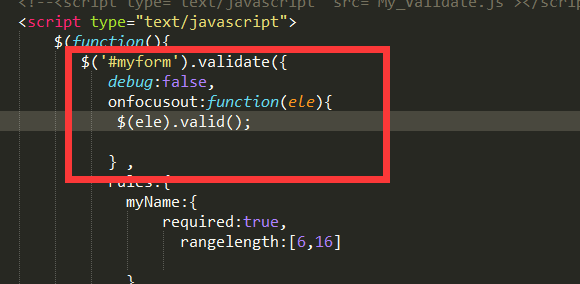

## 表单验证插件使用问题以及经验总结

>  在设置鼠标blur验证的时候报错
```js
//错误代码.....
 $(function() {
     $('#myform').validate({
       debug:false,
       onfocusout:true
     })
     
 })

```

``` js
Object doesn’t support this property or method
 validator.settings[eventType].call is not a function
```
 * 问题原因：
  
       api解释错误
  
 * 解决办法：
 ```js
 
 $(function() {
     $('#form').validate({
       debug:true,
       onfocusout:function(ele) {
         $(ele).valid();        
        }
     
     })
 })
  
```


